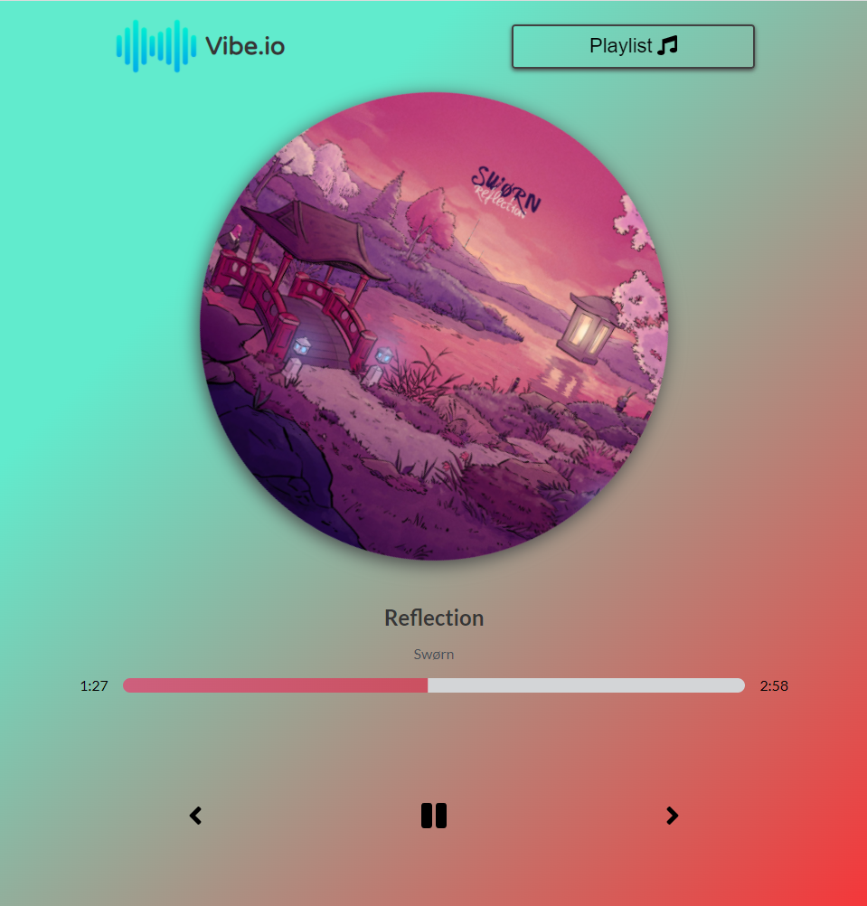
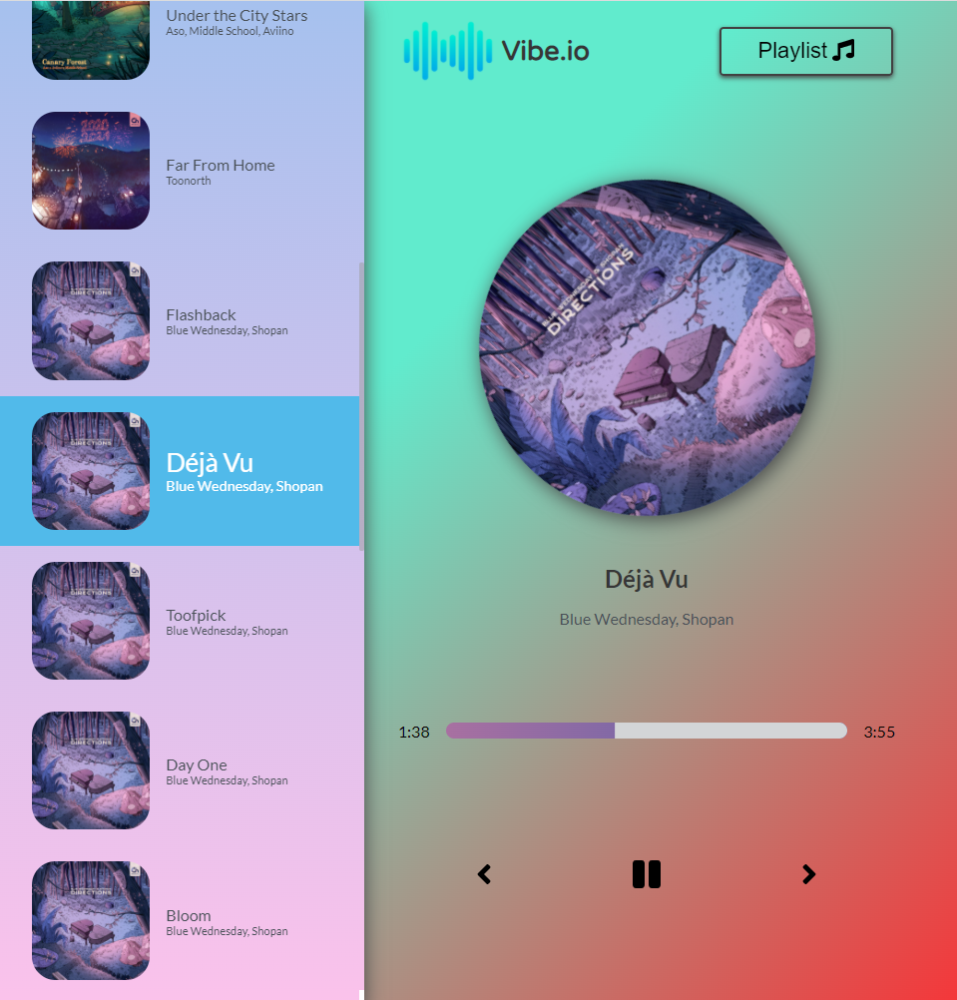

<h1 align="center">
Vibe.io - Music App Idea
</h1>
<h3 align="center">
Vibe here 🎶
</h3>

## About
    - Build using HTML, SASS-CSS & ReactJs
    - Range of productivity lo-fi's, adding to the vibe of the app ✨, which are being fetching from a free music site called [Chill Hop](chillhop.com).
    - Mobile & Tablet compatible!

## Features
All the basic features of a music player are supported
    - progress bar
    - pause & play
    - Skip to next/previous in queue
    - Playlist/Library showing list of available songs
    - Rotating cover animation!

## App Snaps

### Keep Vibing 💜